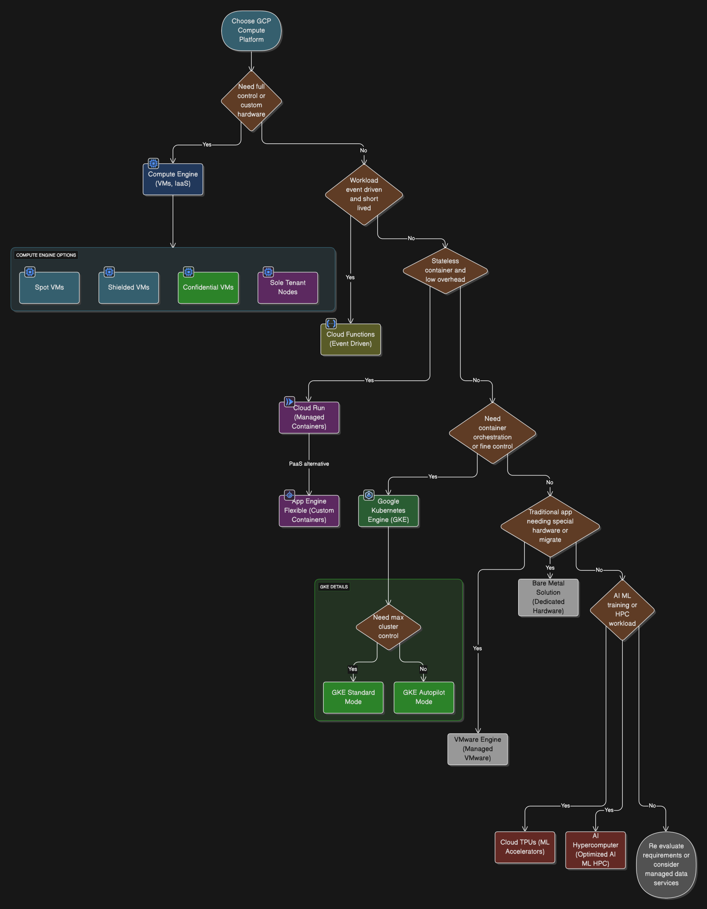

# Workflow (To select Compuute Platform on GCP)

# GCP Compute Options: Quick Revision Cheat Sheet

## Compute Engine (IaaS)

- **Definition:** Google's **Infrastructure-as-a-Service (IaaS)** offering, providing virtual machines (VMs).
- **Control:** Offers the **greatest control** over the operating system, VM instance, and attached storage. You can get root/administrator access.
- **Use Cases:**
  - **Lift-and-shift migrations:** Moving existing on-premises VMs to the cloud with minimal changes.
  - **Custom OS/Software:** When specific OS versions, software, or configurations are required.
  - **Stateful Applications:** Ideal for databases or other applications that manage state on the VM, requiring persistent storage tailored to needs (e.g., SSD Persistent Disks for high IOPS).
  - **Specific Hardware/Licensing (BYOL):** Use **Sole-Tenant Nodes** for dedicated physical servers to meet compliance or licensing requirements (e.g., per-core/per-processor licensing).
- **Key Features:**
  - **Spot VMs (formerly Preemptible VMs):** **Low-cost instances** for **batch jobs** and **fault-tolerant workloads**. Can be shut down by GCP within 24 hours (for Preemptible VMs) or anytime (for Spot VMs). **Not suitable for high-availability services**.
  - **Shielded VMs:** Enhanced security controls, including **Secure Boot** and **vTPM** (virtual Trusted Platform Module) for verifying boot components with digital signatures.
  - **Confidential VMs:** Encrypts data **in use** (memory encryption) using AMD EPYC™ processors, complementing encryption at rest and in transit.
  - **Managed Instance Groups (MIGs):** Clusters of identical VMs managed as a single unit, supporting **autoscaling** and **autohealing** for high availability and scalability. Unmanaged instance groups exist for pre-existing configurations but are generally not recommended for new setups.
  - **GPU/TPU:** Can attach **Cloud GPUs** for ML, scientific computing, and 3D visualization. **Cloud TPUs** are specialized ASICs for large-scale deep learning training.

## App Engine (PaaS - Serverless Application Platform)

- **Definition:** A serverless **Platform-as-a-Service (PaaS)** where you provide application code, and Google manages the underlying servers.
- **Types:**
  - **App Engine Standard Environment:**
    - **Language-specific runtimes/sandboxes** (e.g., Python, Java, Node.js, PHP, Go, Ruby).
    - **Automatic scaling to zero** (for cost efficiency when idle).
    - **No custom containers**.
  - **App Engine Flexible Environment:**
    - Allows **custom runtime environments using Dockerfiles (containers)**.
    - Runs on Compute Engine VMs, offering more flexibility than Standard.
    - Supports SSH for debugging.
- **Use Cases:** Web applications, mobile backends, and APIs where developers prefer to focus on code rather than infrastructure.

## Cloud Functions (FaaS - Serverless Event-Driven Functions)

- **Definition:** A serverless compute service for **event-driven functions**.
- **Characteristics:** Small, single-purpose code snippets that respond to specific events.
- **Use Cases:**
  - **Webhooks:** Responding to HTTP requests.
  - **Real-time data processing:** Triggered by events from other GCP services (e.g., a file upload to Cloud Storage, a message on Pub/Sub).
  - **Automating tasks:** Connecting and extending services (e.g., sending notifications on database changes).
- **Management:** Fully managed, scales automatically, and you only pay for compute time when your function is running.

## Cloud Run (Serverless Containers)

- **Definition:** A **fully managed environment for running stateless containerized applications**.
- **Characteristics:** Combines the flexibility of containers with serverless benefits. You provide a container image, and Cloud Run manages everything else.
- **Use Cases:**
  - **Stateless Microservices:** Ideal for APIs and web applications that don't rely on local disk state.
  - **Rapid Scaling:** Quickly scales from zero to hundreds of instances based on demand.
  - **Pay-per-use:** You only pay when your code is running.
- **Key Distinction:** Offers a simpler deployment model than Kubernetes Engine for stateless containers, **without requiring deep Kubernetes knowledge**.

## Google Kubernetes Engine (GKE - Managed Container Orchestration)

- **Definition:** A **managed environment for deploying, managing, and scaling containerized applications using Kubernetes**.
- **Use Cases:**
  - **Complex Microservices:** When you need advanced container orchestration features like service discovery, load balancing, and rolling updates across many services.
  - **DevOps Automation:** Integrates well with CI/CD pipelines (e.g., Cloud Build, Cloud Deploy).
  - **Hybrid/Multi-Cloud with Anthos:** GKE is a core component of **Anthos**, which extends Kubernetes to on-premises and other cloud environments for consistent management.
  - **Fine-grained Control:** Provides more control over the container environment and underlying infrastructure than Cloud Run or App Engine Flexible.
- **Modes of Operation:**
  - **GKE Standard Mode:** Provides **maximum flexibility and control** over cluster infrastructure (e.g., node pools, networking configuration, Kubernetes version). You pay per node provisioned.
  - **GKE Autopilot Mode:** A **fully managed GKE experience** where Google manages the cluster infrastructure, node provisioning, and scaling. You pay per pod resource consumed. Reduces operational overhead.

## Specialized Compute Platforms

- **VMware Engine:**
  - **Purpose:** Fully managed, native VMware Cloud Foundation software stack on Google Cloud.
  - **Use Case:** Ideal for **migrating existing on-premises VMware workloads** to Google Cloud without refactoring.
- **Bare Metal Solution:**
  - **Purpose:** Infrastructure to run specialized workloads directly on dedicated physical servers in Google Cloud.
  - **Use Case:** For **demanding Oracle workloads** or applications with **strict licensing requirements** that need dedicated hardware. Provides direct access to CPU and memory, bypassing a virtualization layer.
- **Batch:**
  - **Purpose:** Fully managed service for **scheduling batch jobs**.
  - **Use Case:** Running large-scale, scheduled, or ad-hoc batch processing workloads without managing the underlying infrastructure. Often used with Spot VMs for cost optimization.
