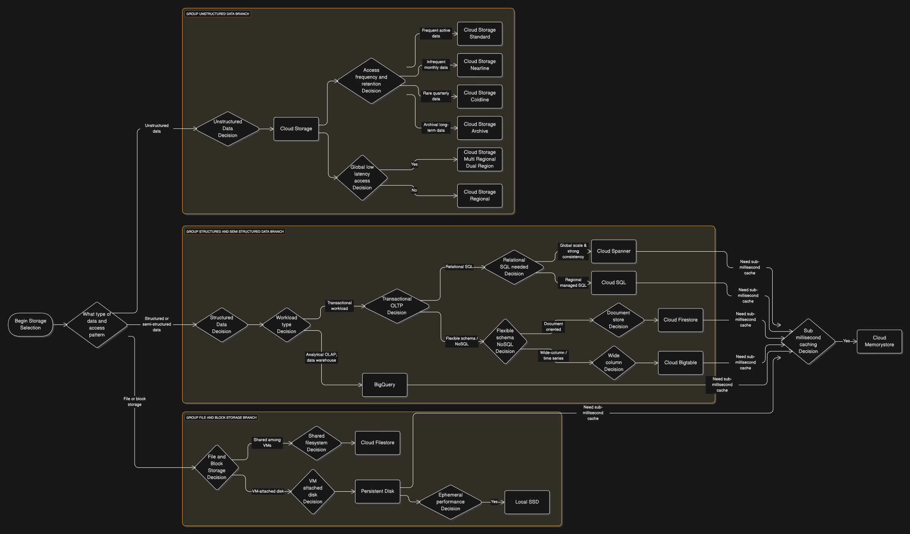

## Storage GCP Flowchart

## Designing Storage Systems – Key Concepts

#### 1. Overview of Storage Services

GCP offers a diverse array of storage options, each designed for different use cases and requirements. You'll need to know:

- **Object Storage (Cloud Storage)**:
  - **Purpose**: Ideal for **unstructured data** like images, videos, backups, and large data files. Data is treated as atomic units.
  - **Key Features**:
    - **Buckets**: Used to group objects and apply access controls.
    - **Storage Classes**: You must understand the four tiers: **Standard**, **Nearline**, **Coldline**, and **Archive**. They vary by access frequency, cost, and minimum storage durations. For instance, Archive is for data accessed less than once a year and is the most cost-effective for long-term retention.
    - **Multi-Regional, Regional, Dual-Region**: Options for geographic distribution, impacting availability and latency.
    - **Lifecycle Management**: Automates transitions between storage classes or deletion based on rules (e.g., age).
    - **Cloud Storage FUSE**: Allows mounting Cloud Storage buckets as filesystems on Linux/macOS for VM-based applications that need file semantics.
- **Network-Attached Storage (Filestore)**:
  - **Purpose**: Managed NFS (Network File System) service, primarily for applications requiring a **shared filesystem** (e.g., home directories, web server content, lift-and-shift of legacy apps).
  - **Service Tiers**: Basic (zonal), High Scale (zonal, HPC), and Enterprise (regional for 99.99% availability).
- **Block Storage (Persistent Disk, Local SSD)**:
  - **Purpose**: Directly attached to Compute Engine VMs, providing disk storage for operating systems and applications.
  - **Types**: Standard, Balanced, SSD, and Extreme Persistent Disks (PDs), offering different IOPS and throughput. Regional PDs provide replication across two zones for higher availability.
  - **Local SSD**: High-performance, low-latency, but **ephemeral** storage that is lost if the VM terminates. Not durable.
- **Databases**:
  - **Relational Databases**:
    - **Cloud SQL**: Managed service for MySQL, PostgreSQL, and SQL Server. Great for **transaction processing** and regional workloads. Supports read replicas for scaling read operations and high availability via failover replicas.
    - **Cloud Spanner**: A globally distributed, horizontally scalable, strongly consistent relational database. Ideal for applications requiring global consistency and high availability.
  - **Analytical Databases**:
    - **BigQuery**: A serverless, fully managed data warehouse and analytics database that uses SQL. Optimized for scanning and aggregating large volumes of data. Billed by data stored and data scanned.
  - **NoSQL Databases**:
    - **Cloud Firestore**: Serverless **document database** for mobile, web, and server development. Offers flexible schemas and real-time synchronization.
    - **Cloud Bigtable**: Petabyte-scale, low-latency, wide-column database. Excellent for **time-series data**, IoT, and operational analytics. Supports HBase API for migrations.
  - **Caching**:
    - **Cloud Memorystore**: Fully managed Redis and Memcached service for **in-memory caching**. Improves availability and reduces latency by storing frequently accessed data outside of volatile instances.

#### 2. Cross-Cutting Design Considerations for Storage

Beyond just product features, the exam expects you to consider how storage impacts the overall system:

- **Data Retention and Lifecycle Management**:
  - Plan for how long data needs to be stored and in what tier, based on access patterns and compliance requirements (e.g., financial data retention for 7 years often uses Archive storage).
  - Use Cloud Storage lifecycle policies to automate tiering and deletion.
- **Network Latency and Data Transfer**:
  - Data location impacts performance. Replicate data across regions/continents (e.g., Cloud Storage Multi-Regional, Cloud Spanner) or use Cloud CDN to serve static content closer to users to reduce latency.
  - Premium Tier networking routes traffic over Google's global backbone for lower latency.
- **Security and Access Management**:
  - **Encryption at Rest**: Google Cloud encrypts all customer data at rest by default, with AES256 or AES128 encryption, without any action required from the customer.
  - **Key Management**: Understand Google-managed encryption keys (default), Customer-Managed Encryption Keys (CMEK) via Cloud KMS, and Customer-Supplied Encryption Keys (CSEK) for varying levels of control.
  - **Access Controls**: Implement fine-grained access using IAM roles and policies on storage buckets, databases, and other resources.
- **Cost Optimization**:
  - Choosing the right storage class (e.g., Archive vs. Standard for Cloud Storage) and database type (e.g., Cloud SQL for regional vs. Spanner for global) can significantly impact costs.
  - Managed services generally reduce operational expenses by offloading administrative tasks like patching and backups to Google.
- **High Availability and Durability**:
  - **Durability**: The probability that stored data will remain accessible. Cloud Storage and most managed databases offer very high durability.
  - **Availability**: The percentage of time a service is functioning. Solutions range from zonal (e.g., default Compute Engine PDs) to regional (e.g., Regional PDs, Filestore Enterprise, Cloud SQL HA) to global (e.g., Cloud Spanner, Multi-Regional Cloud Storage) for redundancy and resilience.

### Exam Significance: The "Why"

Your exam is all about mapping business and technical requirements to the _best_ GCP products. When it comes to storage, this means:

- **Functional Requirements**: Can it store structured, unstructured, or semi-structured data? Does it need SQL or NoSQL? Does it need transactional consistency or is eventual consistency acceptable?.
- **Non-Functional Requirements**: How much data, at what rate, for how long? What are the availability, durability, performance (latency, IOPS), and scalability needs? What are the security and compliance mandates?.
- **Cost Implications**: Always consider the trade-offs between features, performance, and cost. Don't over-engineer for capabilities you don't need.
