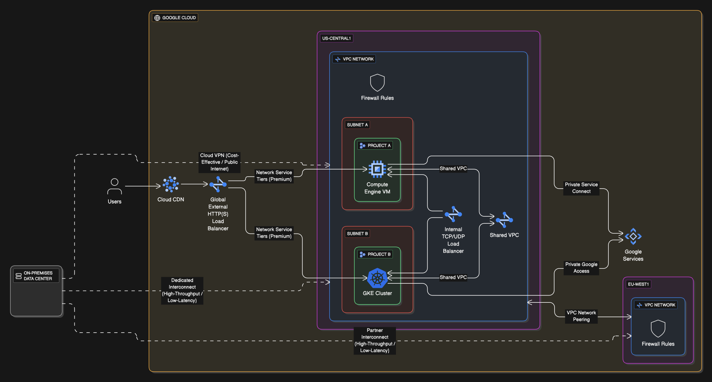

## Sample Architecture Diagram

## **Google Cloud Networking Essentials: Revision Cheatsheet**

**Goal:** Master the core networking concepts and services to design, configure, and troubleshoot connectivity solutions in Google Cloud, hybrid, and multi-cloud environments.

#### **1. Core Networking Fundamentals**

- **OSI Model (Architect's Focus):**
  - **Layer 3 (Network):** IP protocol, packet forwarding, routers. Architects reason about **subnets** and **IP routing** here.
  - **Layer 4 (Transport):** TCP/UDP, data transfer between systems. Relevant for **Load Balancing**.
  - **Layer 7 (Application):** Application protocols (HTTP/S). Critical for **Load Balancing** and **Web Application Firewalls (WAF)**.
- **IP Addressing:**
  - **IPv4:** Uses four octets (e.g., 192.168.20.10).
  - **Public vs. Private:** Public IPs are internet-routable; Private IPs (RFC 1918 ranges like 10.0.0.0/8, 172.16.0.0/12, 192.168.0.0/16) are for internal network communication.
  - **CIDR (Classless Inter-Domain Routing):** Defines IP ranges for subnets (e.g., 172.16.10.2/8, where /8 indicates 8 bits for the network portion).
- **Firewall Rules:**
  - **Global Resource:** Applied at the VPC level, affecting all subnets across regions.
  - **Direction:** Ingress (incoming) or Egress (outgoing).
  - **Priority:** Lower numbers indicate higher priority (0 is highest, 65535 lowest).
  - **Default Rules:** Automatically created for VPCs (e.g., `default-allow-internal`, `default-allow-ssh`, `default-allow-rdp`). Implied rules (all egress allowed, most ingress denied) exist and cannot be deleted, but can be overridden.
  - **Cloud Armor:** A WAF that also provides DDoS protection.
- **Cloud Router:** Google Cloud's software-defined router, uses BGP to exchange routes for VPNs and Interconnects.

#### **2. Virtual Private Clouds (VPCs)**

- **Definition & Scope:**
  - **Global Resource:** A single VPC can span multiple Google Cloud regions.
  - **Isolation:** VPCs isolate customer resources (Compute Engine, App Engine Flexible, GKE clusters) from other Google Cloud customers.
- **Subnets:**
  - **Regional Resources:** Defined within a region with specific IP address ranges.
  - **Modes:** Default, Auto-mode (creates a subnet in every region with a predefined range), and **Custom-mode (recommended for production, full control over subnets and IP ranges)**.
- **Shared VPC:**
  - **Purpose:** Allows resources from _multiple projects_ within the _same organization_ to connect to a common VPC network using **private IP addresses**.
  - **Structure:** One **Host Project** (defines the network) and one or more **Service Projects** (contain resources using the network).
  - **Benefits:** Centralized network management, separation of duties.
- **VPC Network Peering:**
  - **Purpose:** Connects _different VPC networks_ using **private IP address space (RFC 1918)**. Can connect VPCs **across organizations**.
  - **Benefits:** Lower latency (traffic stays on Google's network), increased security (no public internet exposure), **no egress charges** for peered traffic.
  - **Limitations:** No transitive peering (A to B, B to C doesn't mean A to C), limited peering connections per VPC.

#### **3. Hybrid Cloud Networking**

- **Definition:** Provides network services between an **on-premises data center** and Google Cloud, or connects multiple public clouds (**multi-cloud network**).
- **Design Considerations:**
  - **Throughput:** Bandwidth requirements for data transfer.
  - **Latency:** Critical for real-time applications and services spanning environments.
  - **Reliability:** Redundancy to prevent single points of failure.
  - **Network Topologies:**
    - **Mirrored:** Public cloud and on-premises environments mirror each other (good for DR/test).
    - **Meshed:** All systems in all networks can communicate.
    - **Gated Egress/Ingress:** Control exposure of APIs to/from cloud/on-prem.
    - **Handover:** Data processed in one environment, handed over to another.
- **Implementation Options:**
  - **Cloud VPN:**
    - **Virtual Private Network (VPN):** Encrypted IPsec tunnels over the **public internet**.
    - **HA VPN:** High availability (99.99% SLA) using redundant tunnels/interfaces.
    - **Throughput:** Up to 3 Gbps per tunnel.
    - **Cost:** Cost-effective, suitable when high bandwidth/low latency aren't strictly required.
  - **Cloud Interconnect:**
    - **Dedicated Interconnect:** Direct physical connection (10/100 Gbps, scalable to 200 Gbps) between on-premises and Google Cloud, **does not traverse public internet**. Offers high throughput and low latency.
    - **Partner Interconnect:** Connects via a supported third-party service provider (50 Mbps to 50 Gbps).
    - **Encryption:** Dedicated Interconnect traffic is **NOT encrypted by default**; requires application-layer security (TLS) or third-party solutions for IPsec encryption.
    - **Benefits:** Private connectivity, direct IP addressability, high throughput, low latency.
  - **Direct Peering:**
    - **Lowest Level:** Direct connection to Google's network (BGP routing exchange), **not a GCP service**.
    - **Use Case:** Primarily for accessing Google Workspace services in addition to Google Cloud services. Generally less recommended for GCP services compared to Cloud Interconnect.

#### **4. Service-Centric Networking**

- **Private Service Connect (PSC):**
  - **For Google APIs:** Allows VMs with internal IPs to securely reach Google APIs and services (e.g., Cloud Storage, BigQuery) without external IP addresses.
  - **For Published Services:** Enables secure and private consumption of services hosted by other VPCs (service producers) by your VPC (service consumers).
- **Private Google Access:** Enables VMs without external IP addresses in a subnet to reach Google APIs and services using Google's internal network.
- **Serverless VPC Access:** Connects serverless environments (Cloud Run, Cloud Functions, App Engine Standard) to your VPC network, allowing them to access resources via internal IP addresses.

#### **5. Load Balancing & Traffic Optimization**

- **Purpose:** Distributes traffic across resources to ensure high availability, scalability, and performance.
- **Network Service Tiers:**
  - **Premium Tier (Recommended):** Uses Google's global, high-speed backbone network for traffic between regions, resulting in **lower latency and higher availability**. Required for global load balancers.
  - **Standard Tier:** Routes traffic over the public internet, generally lower cost but with higher latency variability.
- **Types of Load Balancers:**
  - **Global Load Balancers (External):**
    - **HTTP(S) Load Balancer:** Layer 7 (application layer), global, distributes web traffic to the nearest healthy backend. Ideal for global applications and integrates with Cloud CDN.
    - **SSL Proxy Load Balancer:** Global, handles SSL/TLS traffic on specific ports, offloads SSL encryption.
    - **TCP Proxy Load Balancer:** Global, handles non-HTTP(S) TCP traffic on specific ports.
  - **Regional Load Balancers (External/Internal):**
    - **Network TCP/UDP Load Balancer:** Layer 4 (transport layer), external, regional, handles TCP/UDP traffic.
    - **Internal TCP/UDP Load Balancer:** Layer 4, **internal to your VPC**, regional, distributes traffic using private RFC 1918 addresses.
- **Cloud CDN (Content Delivery Network):** Caches static content (web pages, videos, images) at Google's globally distributed **points of presence (edge nodes)**, reducing latency for users and minimizing egress costs.
