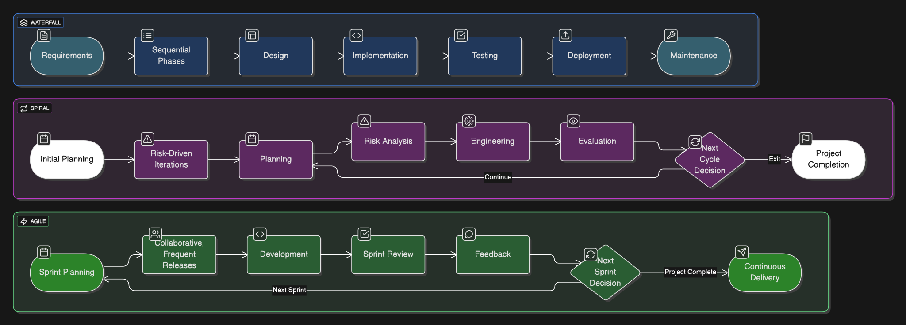
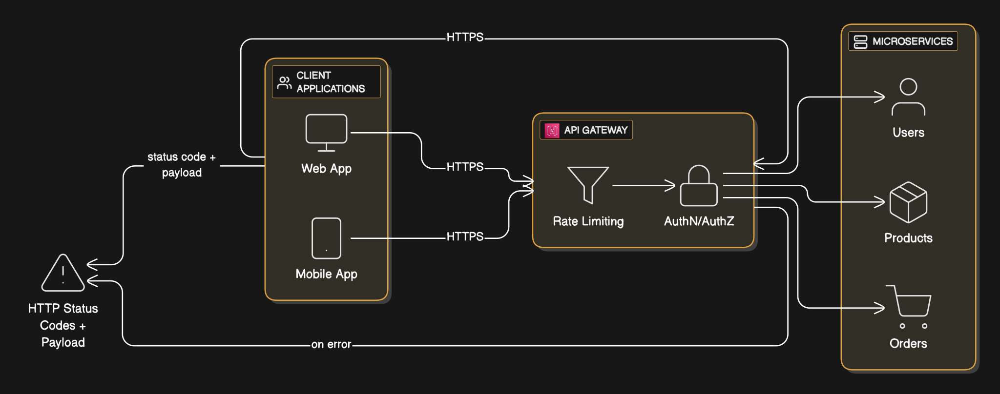
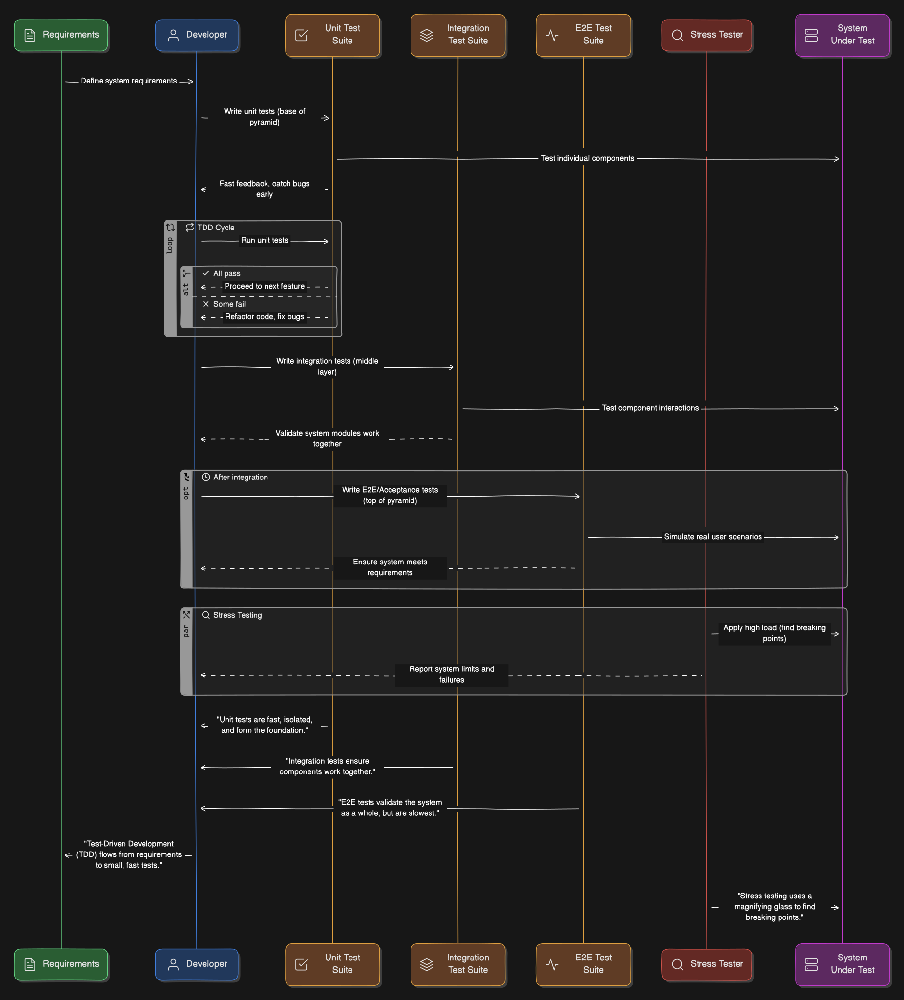
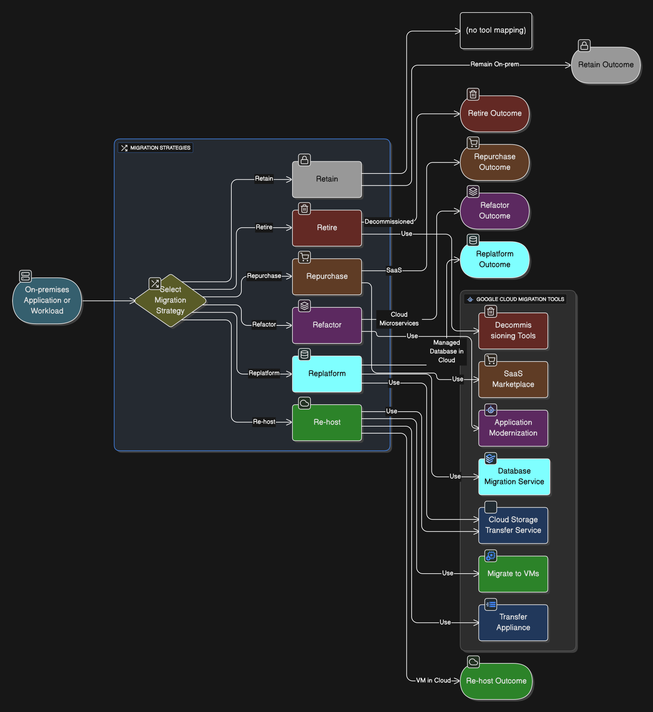
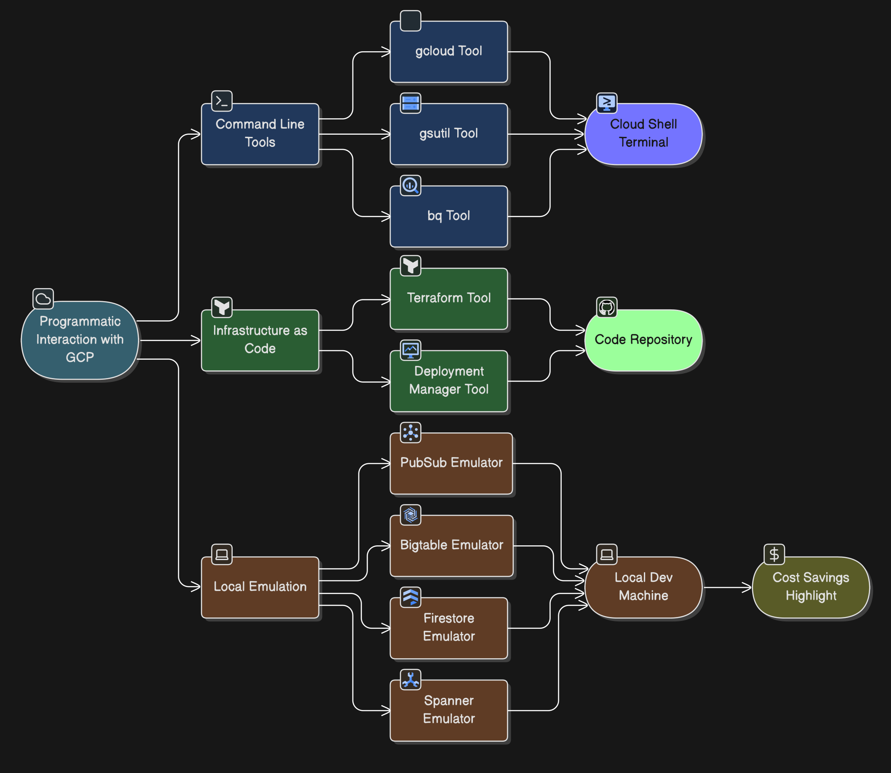

## Development and Operations - Cheat Sheet

### **1. Application Development Methodologies**

- **Core Concept:** These are principles for organizing and managing software development projects, providing a set of practices for developers and stakeholders to produce operational software.
- **Key Types:**
  - **Waterfall:** A **linear, sequential** process where each phase (analysis, design, development, testing, deployment, maintenance) is completed before the next begins. It works best when requirements are well-understood and fixed, like in critical safety software.
  - **Spiral:** An **iterative** model that repeats main phases, focusing on **risk reduction** at the start of each cycle by defining scope and identifying risks.
  - **Agile:** Emphasizes **close collaboration** with stakeholders, **frequent code deployments**, and adaptability to change. It favors working software over comprehensive documentation and supports rapid iteration.

### **2. Technical Debt**

- **Core Concept:** This refers to **suboptimal code or design choices** made, often under time pressure, which incur future rework or maintenance costs. It's a trade-off where you gain speed now but "pay" later.
- **Management:** Technical debt should be actively managed and **"paid down" through refactoring**. Architects and developers should consider this a necessary part of the software development process.

### **3. API Best Practices**

- **Core Concept:** Essential practices for designing and securing Application Programming Interfaces (APIs).
- **Key Practices:**
  - **Entity-Oriented Design:** APIs should be designed around **logical resources** (entities) and the standard operations on them (list, get, create, update, delete), rather than specific functions.
  - **Security:**
    - **Confidentiality & Integrity:** Use **HTTPS** for encryption of data in transit. Google automatically encrypts all infrastructure RPC traffic over the WAN between data centers and secures communications between users and the Google Front End (GFE) using TLS.
    - **Authentication:** API keys can identify applications or devices. Central user identity services issue credentials like cookies or OAuth tokens.
    - **Authorization:** JSON Web Tokens (JWTs) are commonly used for authorizing API calls. The infrastructure provides service identity, mutual authentication, and enforces access policies.
    - **Resource Limiting (Rate Limiting):** Incorporate mechanisms to prevent excessive function calls and resource exhaustion, which maintains service availability.
  - **Error Handling:** When an API call fails, return a **standard HTTP error code** (e.g., 400s, 500s) with additional, detailed information in the message payload.

### **4. Testing Frameworks**

- **Core Concept:** Automated testing is fundamental for efficient **Continuous Integration/Continuous Delivery (CI/CD)** pipelines. It ensures code quality, functionality, and adherence to business requirements.
- **Key Models/Types:**
  - **Data-driven testing:** Tests executed using different sets of input data and expected outputs.
  - **Modularity-driven testing:** Tests broken down into smaller, reusable modules.
  - **Keyword-driven testing:** Separates test data from instructions, with tests defined by sequences of steps using keywords.
  - **Model-based testing:** Uses a model of the system to generate tests.
  - **Test-driven development (TDD):** Requirements are mapped to small, narrowly scoped tests that are written _before_ the code itself. This encourages frequent testing and small code increments.
  - **Hybrid testing:** Combines two or more distinct frameworks.
  - **Stress Testing:** Places increasingly heavy load on a system until it breaks to understand when and how it will fail, and to identify cascading failures.
  - **Unit, Integration, and Acceptance Tests:** Various levels of testing for functionality and system behavior.

### **5. Data and System Migration Tooling**

- **Core Concept:** Strategies and tools for transitioning applications and data to Google Cloud.
- **Key Migration Strategies (The "6 Rs"):**
  - **Re-hosting (Lift and Shift):** Moving infrastructure and data with minimal changes (e.g., VM to Compute Engine).
  - **Replatforming:** Making minor cloud-native changes (e.g., moving a mainframe to a simulated environment).
  - **Repurchasing:** Moving to a Software-as-a-Service (SaaS) solution.
  - **Retirement:** Decommissioning applications no longer needed.
  - **Retaining:** Keeping applications on-premises if migration is not feasible or beneficial.
  - _(Implicit: Re-architecting/Rewriting):_ Modernizing applications to fully leverage cloud-native services.
- **Key Migration Services & Tools:**
  - **Database Migration Service:** For migrating MySQL, PostgreSQL, and SQL Server databases to Cloud SQL with minimal downtime, and can migrate from Cloud SQL for PostgreSQL to AlloyDB. It's serverless.
  - **Transfer Appliance:** For moving **large volumes of data offline** (e.g., petabytes).
  - **`gsutil`:** Command-line tool for **Cloud Storage** data transfers.
  - **Storage Transfer Service:** For data transfers from online and on-premises sources to Cloud Storage.
  - **BigQuery Data Transfer Service:** For scheduling and moving data into BigQuery, including from Teradata.
  - **Migrate to Virtual Machines:** For migrating VMs and physical servers to Compute Engine.
  - **Migrate to Containers:** For migrating VMs into system containers on GKE.
  - **Migration Center:** A unified platform for migrating and modernizing with Google Cloud.
  - **Rapid Migration and Modernization Program:** An end-to-end program to simplify cloud migration.
  - **VMware Engine:** Migrate and run VMware workloads natively on Google Cloud.

### **6. Interacting with Google Cloud Programmatically**

- **Core Concept:** How to use code and command-line tools to manage Google Cloud resources.
- **Key Tools:**
  - **Google Cloud SDK:** A collection of command-line tools and libraries for interacting with GCP services.
    - **`gcloud`:** The primary, versatile command-line tool for interacting with most GCP services. It can also install additional components.
    - **`gsutil`:** Specialized command-line tool for working with **Cloud Storage**.
    - **`bq`:** Specialized command-line tool for interacting with **BigQuery**.
  - **Cloud Shell:** A **browser-based command-line environment** that comes with pre-installed SDK tools and offers 5 GB of persistent storage.
  - **Cloud Emulators:** Tools that enable **local development and testing** of applications for specific services (Cloud Bigtable, Cloud Datastore, Cloud Firestore, Cloud Pub/Sub, Cloud Spanner) **without incurring cloud charges**. They are installed via `gcloud` commands.
- **Infrastructure as Code (IaC):** A best practice for defining and managing infrastructure using code, which improves **reproducibility**, enables **version control**, and supports **code reviews**.
  - **Cloud Deployment Manager:** Uses **declarative templates** to describe and deploy Google Cloud resources.
  - **Terraform:** An **open-source, cloud-agnostic** IaC system that uses HashiCorp Configuration Language (HCL) to manage infrastructure.
