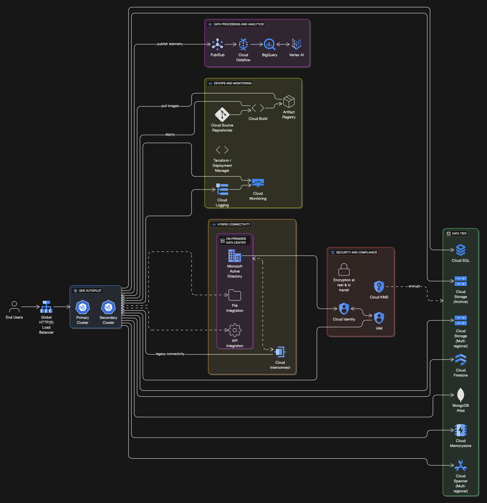

## EHR Potential Architecure Diagram

## EHR Case Study Notes

- **Company Overview & Solution Concept:** EHR Healthcare is a rapidly growing **Software as a Service (SaaS) provider** specializing in **electronic health record (EHR) software** for multinational medical offices, hospitals, and insurance providers. Their core motivation for moving to Google Cloud is to **scale their environment, enhance disaster recovery, and enable continuous deployment** capabilities for faster software updates, driven by an expiring lease on one of their multiple colocation facilities.

- **Existing Technical Environment:**

  - Customer-facing applications are **web-based and containerized**, currently running on **Kubernetes clusters**.
  - Data is stored in a **mixed landscape of relational (MySQL, MS SQL Server) and NoSQL (Redis, MongoDB) databases**.
  - They have **legacy on-premises file- and API-based integrations** with insurance providers, which are _not_ slated for immediate upgrade or migration to the cloud.
  - User management is handled by **Microsoft Active Directory**.
  - Current monitoring uses various **open-source tools**, but a critical issue is that **email alerts are frequently ignored**.

- **Key Business Requirements (Aligns with Exam Objective 1.1)**:

  - **Rapid onboarding** of new insurance providers.
  - Achieve a **minimum of 99.9% availability for all customer-facing systems**.
  - Provide **centralized visibility and proactive action** on system performance and usage.
  - **Increase insights** into healthcare trends and generate related reports/predictions.
  - **Reduce latency** for all customers.
  - Maintain **regulatory compliance**.
  - **Decrease infrastructure administration costs**.

- **Key Technical Requirements (Aligns with Exam Objective 1.2)**:

  - **Maintain legacy interfaces** with connectivity between on-premises and cloud environments.
  - Establish a **consistent method for managing container-based customer-facing applications**.
  - Ensure a **secure and high-performance network connection** between on-premises systems and Google Cloud.

- **Executive Statement (Crucial Context):** The executive explicitly highlights past challenges: **high time and money investment in training disparate on-premises systems, managing similar but separate environments, and frequent outages due to misconfigurations, inadequate capacity for traffic spikes, and inconsistent monitoring**. The vision for Google Cloud is a **"scalable, resilient platform that can span multiple environments seamlessly and provide a consistent and stable user experience that positions us for future growth"**.

- **Architectural Implications & Considerations (Your Analysis):**
  - The emphasis on **scalability, resilience, and multi-country operations** strongly suggests a **multiregional deployment strategy**.
  - Their existing Kubernetes usage points directly to **Google Kubernetes Engine (GKE)** as the compute platform. Consider **Autopilot mode** for managed operations and cost savings.
  - **Cloud Identity, integrated with Microsoft Active Directory**, would facilitate user management.
  - To address the issue of misconfigurations and inconsistent deployments, **Infrastructure as Code (e.g., Cloud Deployment Manager or Terraform)** combined with **Continuous Integration/Continuous Delivery (CI/CD) pipelines (Cloud Build, Cloud Source Repository, Artifact Registry)** is a must.
  - To combat "ignored alerts" and "inconsistent monitoring," **Cloud Monitoring and Cloud Logging** are the default GCP solutions for centralized observability.
  - The nature of EHR data immediately flags **HIPAA/HITECH compliance** as a primary concern for data residency, security, and access controls.
  - The need for **high-performance, secure on-premises to cloud connectivity** points to **Cloud Interconnect or VPN solutions**.
