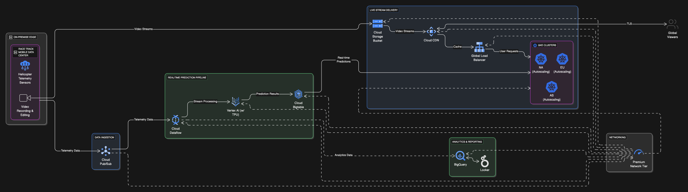

## Architecture Diagram

## Helicopter Racing League (HRL): A Deep Dive [#Reference](https://services.google.com/fh/files/blogs/master_case_study_helicopter_racing_league.pdf)

The Helicopter Racing League (HRL) is a **global sports provider specializing in competitive helicopter racing**, streaming races worldwide with live telemetry and predictions. Their core mission is to bring "high-adrenaline racing to fans all around the world".

Here's a breakdown of their current state and aspirations:

- **Current State:**

  - A **public cloud-first company** running mission-critical applications on an existing public cloud provider.
  - Video recording and editing happen at **race tracks** and are then **uploaded to the cloud** for processing on virtual machines (VMs).
  - They use **truck-mounted mobile data centers** for enterprise-grade connectivity and local compute at race sites.
  - An **object storage system** is used for content storage.
  - They utilize **TensorFlow** for predictions, running on VMs in the cloud.

- **Business Requirements & Goals:**
  - **Expand predictive capabilities** for real-time race events (e.g., overtakes, mechanical failures, crowd sentiment) and process season-long results.
  - **Reduce viewer latency** and increase the number of **concurrent viewers**, especially in emerging markets.
  - **Enhance global availability and quality** of broadcasts.
  - **Minimize operational complexity** while ensuring compliance with regulations.
  - Increase **telemetry data collection**.
  - Increase post-editing video processing performance.
  - Provide additional analytics and data mart services.
  - Explore a **merchandising revenue stream**.

### Architectural Considerations for HRL

Given HRL's needs, an architect would focus on these key areas:

1.  **AI/ML and Data Processing:**

    - The emphasis on AI and ML, particularly with TensorFlow, makes **Vertex AI** a prime candidate for developing, deploying, and scaling machine learning models. This directly addresses their need to increase prediction accuracy and expose models to partners.
    - For increasing **telemetry data collection**, **Cloud Pub/Sub** is ideal for ingesting large volumes of streaming data reliably.
    - **GPUs or TPUs** would be essential for improving the performance of their TensorFlow deep learning models.
    - For analytics and data marts, **BigQuery** is a strong choice due to its scalability and fully managed nature, suitable for hundreds of terabytes of data. For low-latency writes and key-based lookups (e.g., time-series data), **Cloud Bigtable** could be used.
    - Implementing **MLOps practices**, including automated CI/CD for ML pipelines (like **Vertex AI Pipelines**), would help ensure reliable and rapid model deployments.

2.  **Global Reach & Performance (Low Latency/High Availability):**

    - Reducing latency for a global viewer base points to using **Google Cloud's Premium Tier network services** over the Standard Network Tier.
    - **Cloud CDN** is critical for high-performance edge caching of recorded content, delivering it closer to viewers to reduce page load times and improve their experience.
    - Deployment across **multiple regions** is implied for global availability and disaster recovery, potentially leveraging **Kubernetes Engine** with appropriate scaling and a **Google Cloud global load balancer**. This supports high availability and increasing concurrent viewers.

3.  **Operational Efficiency & Compliance:**

    - HRL's desire to **minimize operational complexity** suggests a strong inclination towards **managed services**. This offloads administrative burdens, aligning with a "cloud-first" strategy.
    - Ensuring **compliance with relevant regulations** is a constant business requirement. Architects must consider how GCP services can meet these needs, such as data residency requirements (though not explicitly detailed for HRL's regulations in the source, it's a general compliance point).

4.  **Storage:**
    - For large volumes of unstructured data like race recordings, **Cloud Storage** (Google Cloud's object storage) would be the go-to.
    - For structured telemetry data, **Bigtable** is suitable due to its low-latency reads/writes and scalability for time-series data.

This comprehensive approach allows HRL to leverage Google Cloud's strengths to meet its ambitious growth and technical requirements.

### Test Me!

A global helicopter racing league streams live races worldwide and needs to provide real-time predictions to millions of concurrent viewers. They also want to collect vast amounts of telemetry data from the helicopters for enhanced predictive analytics. The CEO emphasizes minimizing viewer latency and optimizing operational complexity.

Which combination of Google Cloud services would best meet the core requirements for _ingesting real-time telemetry data_ and _delivering live video streams with minimal latency_ to a global audience?

A. Cloud Storage and Compute Engine
B. Cloud Pub/Sub and Cloud CDN
C. BigQuery and Cloud Spanner
D. Cloud Dataflow and Cloud Functions

 

... Ready for the answer?

The correct answer is **B. Cloud Pub/Sub and Cloud CDN**.

- **Cloud Pub/Sub** is excellent for ingesting large volumes of real-time telemetry data from globally distributed sources due to its scalability and decoupling capabilities.
- **Cloud CDN** is designed to cache content at edge locations worldwide, significantly reducing latency for viewers accessing live video streams by serving content from locations geographically closer to them.

**Justification:** This question directly maps to **Exam Objectives 1.2 (Designing a solution infrastructure that meets technical requirements – performance and latency, scalability)** and **1.3 (Designing network, storage, and compute resources – choosing data processing technologies, cloud-native networking)**. It highlights the need to select appropriate services for high-volume data ingestion and global content delivery, which are explicit business and technical requirements for HRL.

- A is incorrect: Cloud Storage is for object storage, not real-time ingestion, and Compute Engine alone wouldn't optimize for global low-latency streaming without other services.
- C is incorrect: BigQuery is for analytics/data warehousing, not real-time ingestion, and Cloud Spanner is a transactional database, not a streaming or content delivery service.
- D is incorrect: Cloud Dataflow is for stream/batch processing, and Cloud Functions are for event-driven serverless compute, neither of which primarily addresses content delivery or initial high-volume ingestion as effectively as Pub/Sub and CDN together.
