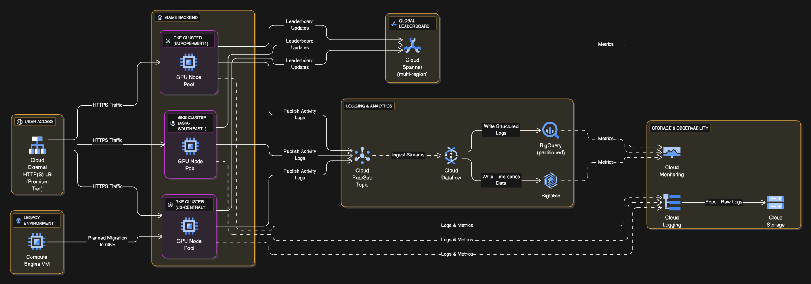

## Architecture Diagram

## Mountkirk Games Overview [#Reference](https://services.google.com/fh/files/blogs/master_case_study_mountkirk_games.pdf)

Mountkirk Games is a company that develops **online, session-based, multiplayer games for mobile platforms**. They have recently **expanded to other platforms** after successfully migrating their on-premises environments to Google Cloud. Their latest project is a retro-style first-person shooter (FPS) game designed to support **hundreds of simultaneous players in geo-specific digital arenas** across multiple platforms and locations. A key feature is a **real-time global leaderboard** displaying top players.

Their existing environment includes five legacy games that were migrated to Google Cloud using a **lift-and-shift virtual machine (VM) migration** approach, with minor exceptions. New games exist in isolated Google Cloud projects nested under a folder that manages permissions and network policies, while legacy games with lower traffic have been consolidated into a single project. Separate development and testing environments are also in place.

### Business Requirements

The business requirements for Mountkirk Games include:

- **Support multiple gaming platforms.**
- **Support multiple regions.**
- **Support rapid iteration of game features.**
- **Minimize latency.**
- **Optimize for dynamic scaling.**
- **Use managed services and pooled resources.**
- **Minimize costs.**

The executive statement emphasizes that their first cloud-based game was a "tremendous success," enabling advanced analytics, leading to a "full migration to the cloud" and building new games with "cloud-native design principles". **Latency is their top priority, with cost management as the next most important challenge**. They also expect advanced analytics capabilities for rapid iteration.

### Technical Requirements

To support these business goals, Mountkirk Games has the following technical requirements:

- **Dynamically scale based on game activity.**
- **Publish scoring data on a near real-time global leaderboard.**
- **Store game activity logs in structured files for future analysis.**
- **Use GPU processing to render graphics server-side for multi-platform support.**
- **Support eventual migration of legacy games to this new platform.**

### Architecture Considerations

Based on these requirements, here are the key architectural considerations and recommended Google Cloud services:

- **Game Backend and Scaling:** The plan is to deploy the new game's backend on **Google Kubernetes Engine (GKE)** to support rapid scaling. GKE supports **dynamic scaling**. The use of **Google's global load balancer** will route players to the closest regional game arenas, helping to **minimize latency**.
- **Global Leaderboard:** For a global, real-time leaderboard that requires **strong consistency**, **Cloud Spanner** is the go-to choice. It's a globally scalable, strongly consistent relational database.
- **Gaming Platforms & Graphics:** To support multiple device platforms and render graphics consistently, **server-side GPU processing** will be used. This implies using Compute Engine VMs with attached GPUs, or potentially GKE node pools configured with GPUs.
- **Managed Services Preference:** The business preference for **managed services and pooled resources** aligns well with GKE and Cloud Spanner, which are fully managed platforms.
- **Game Activity Logs:**
  - **Cloud Logging** can ingest custom log data generated by game activity.
  - Since Cloud Logging typically retains logs for 30 days, a **log sink** would be needed to export these structured logs to **Cloud Storage** or **BigQuery** for long-term storage and analysis.
  - For analysis of structured log data, **BigQuery is a strong option** as it's a fully managed analytical database that scales well, supports SQL, and charges based on data scanned [97, 100, 117–118, 189, 270, 470, 482, 486].
  - For time-series data like game state or player behavior, **Cloud Bigtable** is a suitable managed NoSQL option for its low-latency writes and scalability.
- **Migration of Legacy Games:** The existing lift-and-shift VMs for legacy games will eventually be migrated to the new GKE platform. This highlights the **"move and improve" migration strategy**.

### Exam Relevance

Mountkirk Games serves as an excellent case study for several exam objectives:

- **Section 1.1: Designing a solution infrastructure that meets business requirements**: It directly tests your ability to interpret business needs like "minimize latency," "minimize costs," and "support rapid iteration" and translate them into appropriate cloud services. The trade-offs between cost and performance (e.g., choosing between storage classes, or global vs. regional services) are central.
- **Section 1.2: Designing a solution infrastructure that meets technical requirements**: This includes designing for **high availability and failover** (multi-region Spanner, global load balancing, GKE), **elasticity/scalability** (GKE autoscaling, BigQuery, Bigtable), and **performance/latency** (Cloud CDN if applicable for static content, global load balancer).
- **Section 1.3: Designing network, storage, and compute resources**: You'll be tested on choosing the right compute (GKE with GPUs), storage (Cloud Spanner, Cloud Storage, BigQuery, Bigtable), and networking technologies (global load balancing, multi-region deployments).
- **Section 2.2: Configuring individual storage systems**: This scenario demands a clear understanding of the different Cloud Storage classes for various data access patterns and the capabilities of different database types (relational vs. NoSQL, global vs. regional).
- **Section 6.1: Monitoring/logging/profiling/alerting solution**: The need to analyze player behavior and game telemetry directly points to services like Cloud Logging and BigQuery for observability and analysis.
