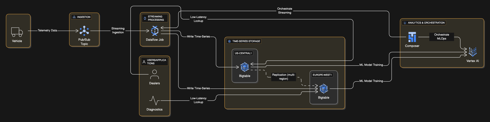

## Architecture

## TerramEarth: A Case Study Deep Dive [#Reference](https://services.google.com/fh/files/blogs/master_case_study_terramearth.pdf)

TerramEarth is a heavy equipment manufacturer for the agriculture and mining industries. They operate globally, with over 500 dealers in 100 countries and more than 2 million vehicles in operation, experiencing a 20% annual growth. This case study presents common challenges around massive data ingestion, advanced analytics, and modernizing development practices.

**Existing Environment & Operations:**

- Vehicles collect extensive **telemetry data** from many sensors.
- A small, critical subset of data is transmitted **in real-time** for fleet management.
- The majority of sensor data (200-500 MB/day per vehicle) is collected, compressed, and **uploaded daily** when vehicles return to home base.
- Their vehicle data aggregation and analysis infrastructure is **already in Google Cloud** and serves clients worldwide.
- Sensor data from manufacturing plants is sent to **private data centers** that host their legacy inventory and logistics management systems.

**Business Requirements & Architectural Implications:**
TerramEarth's business requirements include:

- Improving the ability to **predict malfunctions** in equipment. This immediately points to **AI and Machine Learning** solutions.
- Increasing the **speed and reliability of development workflows**. This suggests a need for robust **CI/CD practices** and efficient developer tooling.
- Enabling developers to create **custom APIs more efficiently**. This highlights the importance of API management and integration.

**Key Technical Considerations and Google Cloud Solutions:**

Given the massive scale and data types, here's how you'd typically approach TerramEarth's challenges:

- **Data Ingestion & Storage:**

  - The need for **highly available data ingestion** that scales with 2 million vehicles and 20% annual growth is paramount.
  - For buffering and decoupling data producers from consumers, especially when dealing with streaming data, **Cloud Pub/Sub** is a strong recommendation to prevent data loss if ingestion services lag.
  - For storing the high volume of real-time, low-latency time-series telemetry data, **Cloud Bigtable** is the optimal choice. It offers excellent write performance, scalability, and supports regional replication for improved availability.

- **Analytics & Machine Learning:**

  - For building predictive models to anticipate equipment malfunctions, **Vertex AI** is the central platform. If much of the sensor data is structured, **AutoML Tables** could be used. For more complex deep learning models, leveraging **GPUs or TPUs** would be essential.
  - For preliminary analysis of large datasets (e.g., 20 TB), **BigQuery** is an excellent analytical database solution, supporting SQL queries.
  - Complex, multi-step MLOps workflows (like training models, making predictions, and triggering part shipments based on predictions) are best orchestrated using **Cloud Composer**, which supports Directed Acyclic Graphs (DAGs) for reliable execution.

- **Developer Productivity & Integration:**

  - To enable efficient custom API creation and data sharing with dealers, APIs are key. This allows dealers to access up-to-date information without needing to understand underlying database implementation details.
  - The emphasis on reliable and scalable development workflows implies the need for robust **CI/CD pipelines**.

- **Envisioning Future Improvements:**
  - Architects are expected to think ahead. For TerramEarth, this might involve planning to eventually retire the batch data load process in favor of real-time or near real-time data uploads for _all_ vehicles.
  - Future opportunities could include using **image analysis** (e.g., via AutoML Vision Edge) if vehicles start transmitting images for detecting environmental problems.

### Case Studies as an Exam Focus

The TerramEarth case study, along with EHR Healthcare, Helicopter Racing League, and Mountkirk Games, are explicitly part of the Professional Cloud Architect exam. They are not just background information; they are the bedrock upon which many exam questions are built.

**Your Strategy for Case Studies:**

1.  **Read Carefully, Understand Deeply:** Each word in a case study matters, both for explicit and implied requirements. Business requirements often constrain technical options, so understand the "why" behind the "what".
2.  **Map to GCP Services:** Identify existing systems and mentally (or physically, in your scratchpad) map them to appropriate Google Cloud services that offer comparable or improved functionality.
3.  **Prioritize Requirements:** Recognize that solutions must first meet technical and business requirements _before_ optimizing for cost. High availability, scalability, and reliability are fundamental technical considerations.
4.  **Consider the Full Lifecycle:** The exam covers the entire solution lifecycle, from initial planning (analysis of business and technical requirements, migration planning, future improvements) to management, security, and operations (monitoring, logging, reliability, CI/CD). TerramEarth touches on all these areas.
5.  **Anticipate Growth and Change:** As seen with TerramEarth's 20% annual growth, solutions must be designed for future scaling and evolving business needs.

Mastering these case studies means mastering the application of Google Cloud architectural principles.
